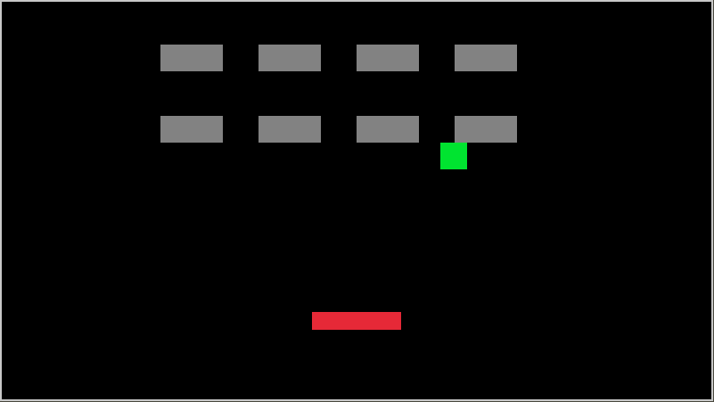

# Breakout in C++

Simple breakout implementation using C++ and [raylib](https://www.raylib.com/)

## Build
Dependencies handled by [conan](https://conan.io/)

```bash
$ git clone https://github.com/ShadowCurse/lang_remix.git
$ cd lang_remix/breakout_cxx
$ mkdir build && cd build
$ conan install .. --build=missing
$ cmake ..
$ make -j
```

## Example

